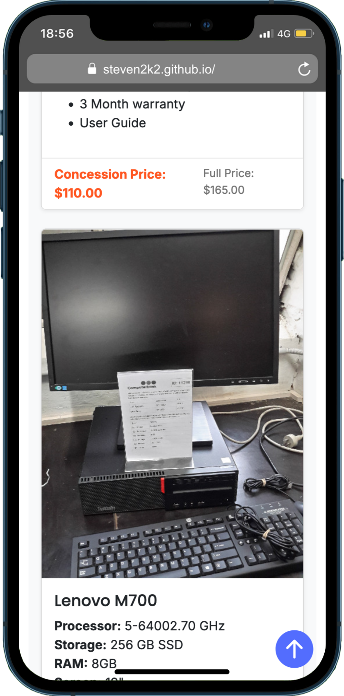

# Databanken Demo Website

This project uses **EJS (Embedded JavaScript templates)** to generate static web pages for a demo website. The static files are built from templates and assets, making it suitable for deployment on platforms like **GitHub Pages**.

---

## Features

- **EJS Template Rendering**: Create reusable templates for consistent design and structure.
- **Static Site Generation**: Convert dynamic EJS templates into static HTML files.
- **Responsive Design**: Built using **Bootstrap 5** for modern, mobile-friendly layouts.
- **Asset Management**: Automatically copies CSS, JavaScript, and image assets to the output directory.
- **Automated Deployment**: Deploys to **GitHub Pages** using GitHub Actions.

---

## Device Mode in Chrome Developer Tools

**Device Mode** allows developers to simulate various devices and test responsive designs directly in Chrome.

### How to Enable Device Mode

1. **Open Developer Tools**:
    - Right-click on any webpage and select **Inspect**.
    - Alternatively, press `Ctrl+Shift+I` (Windows/Linux) or `Cmd+Option+I` (Mac).

2. **Enable Device Mode**:
    - Click the **Device Mode** icon (a small phone and tablet) in the top-left corner of Developer Tools to toggle it on.

---

### Using Device Mode

1. **Select a Device**:
- Use the dropdown menu to choose a predefined device like "iPhone 12".
- Add more devices by clicking the **Edit** option in the menu.

2. **Capture Screenshots**:
- Click the three-dot menu in Developer Tools and select **Capture Screenshot**.




## Installation

### Prerequisites

- **Node.js** (16 or higher)
- **npm** (Node Package Manager)

### Setup

1. Clone the repository:
   ```bash
   git clone https://github.com/steven2k2/databanken.git
   cd databanken
   ```

2. Install dependencies:
   ```bash
   npm install
   ```

---

## Usage

### Run the Development Server

For previewing your EJS templates during development:

```bash
npm run dev
```

- Opens the site locally on `http://localhost:3000`.

### Build Static Files

To generate the static files in the `dist/` directory:

```bash
npm run build
```

- Converts EJS templates to static HTML.
- Copies assets from the `public/` directory to `dist/public`.

---

## Directory Structure

```
.
├── views/               # EJS templates
├── public/              # Static assets (CSS, JS, images)
├── dist/                # Output directory for static files
├── app.js               # Development server
├── generate-static.js   # Static site generator script
├── package.json         # Project metadata and dependencies
└── deploy.yml           # GitHub Actions workflow for deployment
```

---

## Deployment

### Deploy Locally

1. Build the site:
   ```bash
   npm run build
   ```

2. Manually deploy the `dist/` directory to your hosting platform.

### Deploy to GitHub Pages

This project is configured to deploy automatically to GitHub Pages upon pushing changes to the `main` branch.

- **GitHub Actions Workflow**:
    - The `deploy.yml` workflow builds and deploys the site to the `gh-pages` branch.
    - Deployment URL: `https://steven2k2.github.io/databanken/`

To trigger deployment:

1. Push changes to the `main` branch:
   ```bash
   git add .
   git commit -m "Update site"
   git push origin main
   ```

---

## Development Notes

- **Base Path**: The project uses a `basePath` variable (`/databanken/`) to ensure asset and link paths are correct for GitHub Pages deployment in a subdirectory.
    - Update the `basePath` in `generate-static.js` if the site location changes.

- **Dependencies**:
    - **Handlebars**: For rendering templates.
    - **Bootstrap**: For responsive styling.
    - **Font Awesome**: For icons.
    - **gh-pages**: For automated GitHub Pages deployment.

---

## Contributing

Feel free to submit issues or pull requests to improve this demo site. Contributions are welcome!

---

## License

This project is licensed under the ISC License. See the [LICENSE](https://opensource.org/licenses/ISC) file for details.

---

### Additional Resources

- [GitHub Pages Documentation](https://docs.github.com/en/pages)
- [Handlebars Documentation](https://handlebarsjs.com/)
- [Bootstrap Documentation](https://getbootstrap.com/)

---

[](https://github.com/standard/standard)